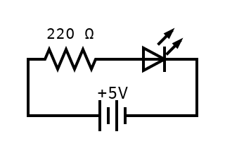

# Blink External LED

Using a breadboard and a resistor to blink an external led.

The sketch stays the same as with the internal led, but we specify another pin to make it more interesting. We will use pin 12 for that. We also declare a constant outside of setup and loop to use it across the sketch.

## Resistors

To prevent the led from damages we have to use a resistor. They are tiny little things that have a resistance. They have color stripes around them that indicate how mich they have.

In this case we need 220 Ohm and our resistor is a 5 band. Which means we read the colors of the first three bands to have the first three digits. It is red (2), red (2) and black (0), which means 220. The fourth band declares the multiplier. In our case this is black, which means 1. So we have a resistance of 220 Ohm. There is a fifth band, which declares the tolerance. Ours is golde, which means ± 1% of tolerance.

The resistors can come in 3/4 bands, then the 1. and 2. band are the rings and the 3. is the multiplier and when 4. it is the tolerance.

When it has 5/6 bands, then the first three bands are the digits, the 4. is multiplier, 5. is tolerance and 6. is temperature coefficient, which is not so common to have.

There is a tricky thing to know from which side to read. But it always goes from left to right and does not start with a metal color and a resistor typically is within a range, so if that does not make sense you should flip that.

In a schematic you would draw it with a triangle wave like line.

## Leds

The LED has a long and a short leg. The long leg is the anode and is postive, which means it goes to the resistor and in the pin from the arduino. So that the resistir can lower the current going into the led. The cathode is negative and going to the ground.

The schematic for an led is a triangle with the long side to the left and a line on the edge with two arrows pointing outside. The longs side is the anode and the plus side of it.

## Schematic

## Some Math

In order to calculate the strength of the resistor you need to apply ohms law, which says Voltage = Current x Resistance.

- Voltage of Arduino is 5V
- Voltage Drop of Led is around 2V
- Current through LED should be 20mA
- Since in Series Current through resistor is also 20mA

With a series to get the voltage you subtract the voltage drop from the power, which is 5V - 2V = 3V.
To get the resistance you divide it by the Current through the resistor which is 3V / 0.02A = 150 Ohm.
This means we need at least a 150 Ohm resistor.
Taking more, in our case will result in the LED not being as bright.

## Things I have learned

- Since the resistor and led are placed in series, it seems to not matter which comes first.
- Schematics use long line on battery for + and short for - side
- The anode (long leg) of the led is facing to the plus side and the cathode (short leg) of the led is facing to the minus side
- Voltage drop is the battery voltage - the Vf (Voltage forward) of the LED
- An LED typically has a Vf of 1.8V and needs 0.02A of current
- Resistors have colored bands, a 5 band uses the first three bands for digits, the 4. as multiplier and 5. as tolerance