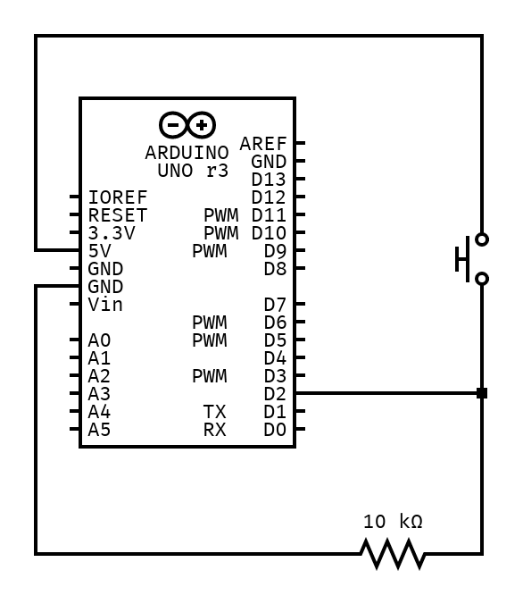

# Switch Pull Down Resistor

Connecting a push button requires to use a pull down resistor.

## Pushbuttons
A pushbutton has four pins that are symetrical on both left and right sides. 
When the button is up, the top and bottom parts are not connected, meaning it is open. 
When the button is down, the top and bottom parts are connected, meaning they create a short between them.

## Pull Down Resistor
When you have a push button and connect one part (up) of it to 5V and the other (down) to the digital pin of the arduino, it will only detect 5V when the switch is down, but when its open, the pin will read all sort of noise. 

To avoid that there is this concept of pull down resistors that live in a circuit with a switch. You need to place a 10 kOhm resistor next to the down part of the switch and connect it to ground. This makes that when the switch is open, the resistor prevents current flowing to ground, which makes the pin read 0V. When the switch is closed it will go the path of least resistance and read 5V on the pin.

## Ressources
Related to this concept:
- [Video - How to use a Button with an Arduino](https://www.youtube.com/watch?v=yBgMJssXqHY&list=PLlBVuTSjOrclb0iCMSRpS_H1lSrlSVeEm&index=5)
- [Video - Understand Push Buttons and Pull Up and Pull Down Resistors](https://www.youtube.com/watch?v=AgQW81zzR18)
- [Video - Pullup and Pulldown Resistors](https://www.youtube.com/watch?v=aPVMKyZpaPA)

Other things:
- [Book - Getting Started in Electronics - Forrest M. Mims](https://www.worldradiohistory.com/BOOKSHELF-ARH/Technology/Radio-Shack/Engineer's%20Mini-Notebook%20-%20Getting%20Started%20in%20Electronics.pdf)
- [Book - Fun Way into Electronics - Dick Smith](https://archive.org/details/dicksmithsfunwayintoelectronicsvolume2/Dick%20Smith%27s%20Funway%20into%20Electronics%20Volume%201/mode/2up)

## Things I learned
- Pushbuttons have four legs, but since they are symatrical you only need to care about two
- Pull Down Resistors (inserted between a pin and ground) help to pull a value down to the ground or making it 0V for that