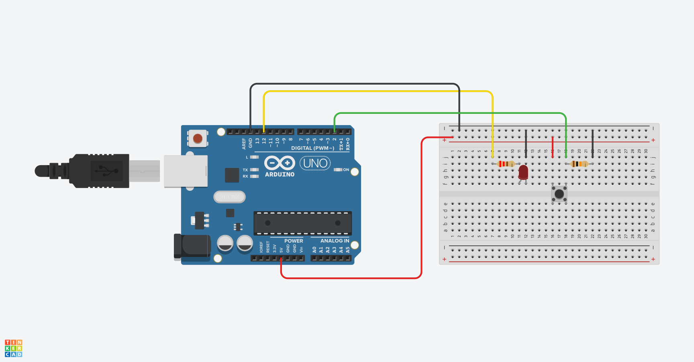

# LED with Button

Combining and external LED with a pushbutton.

## Using Tinkercad

There is an online tool called Tinkercad where you can build circuits online and test them. 

[View Circuit](https://www.tinkercad.com/things/ha6hG4YlmwL-05-led-with-button-241007?sharecode=HZLQ18Ec8iiW67-CqShpi-FrVMQytkgUsRJuj9ePY4Q)

It also lets you export an image of it.

You could also get the schematic of it as well.

## Things I have learned
- Building circuits with Tinkercad helps to plan things
- Build the same circuit again and again helps to remember how its done