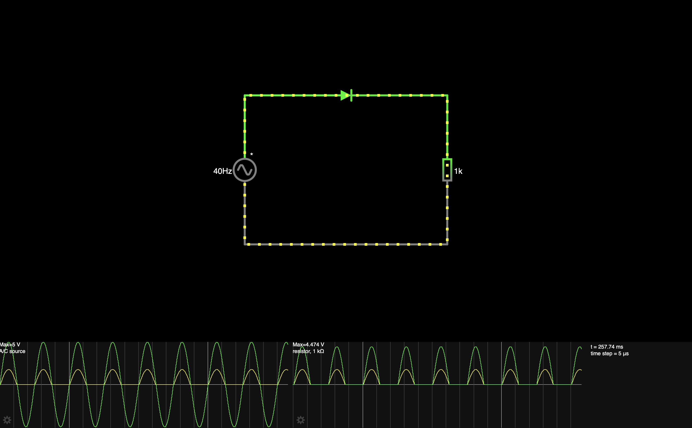
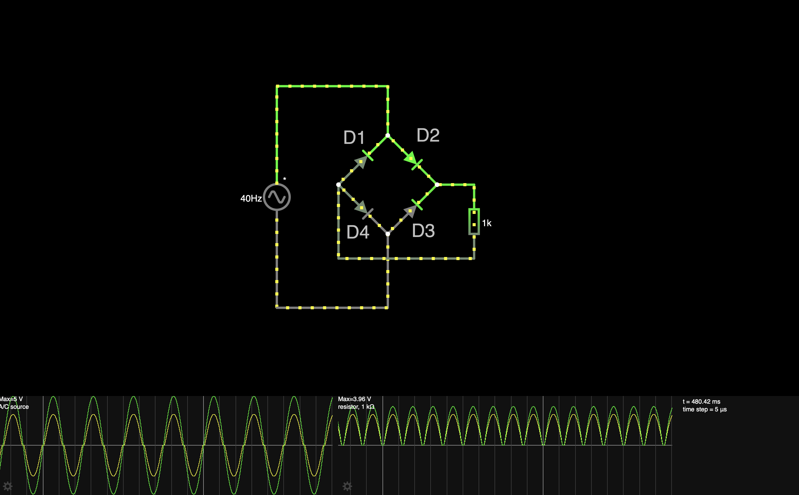

# Wave Rectifiers

Wave rectifiers are circuits that convert alternating current (AC) to direct current (DC). 

There are two main types:
- Half Wave Rectifiers
- Full Wave Rectifiers

## Half Wave Rectifier
A half-wave rectifier uses a single diode to allow only one half of the AC cycle (either positive or negative) to pass through. 
As a result, only half of the input waveform is used, and the output is a pulsating DC that has gaps when the AC waveform goes negative. 
This leads to a lower average output voltage compared to the input signal.

Key points of a half wave rectifier:
- Simple circuit design (one diode).
- Inefficient since it uses only half of the AC signal.
- The output needs further smoothing for steady DC.

[View Simulation](https://www.falstad.com/circuit/circuitjs.html?ctz=CQAgjCAMB0l3BWcBmWBOA7AFjA5AmMSADjGIDYIEkbIQEBTAWjDACgA3cMfEAu1rzTko4EFjpI606AjYAncWBHClI-qKJw2AE25CROFSN46GAMwCGAVwA2AFzYB3fX3x0jb6WwD2o8liiEmho9FCwPFIgvHTIvmIBQZAhYTCQkWK8EHFAA)

## Full Wave Rectifier
Full-wave rectifiers convert the entire AC waveform (both positive and negative halves) into DC.  
This is more efficient than a half-wave rectifier and provides a higher average output voltage.

They can be implemented in two main ways:

- Using a center-tap transformer with two diodes.
- Using a bridge rectifier with four diodes.

### Full Wave Bridge Rectifier
In the bridge rectifier setup, four diodes are arranged in a diamond shape to redirect both halves of the AC input.

How it works:  
During the positive half-cycle of the AC input, Diodes 1 and 3  conduct, allowing current to flow through the load in one direction.  
During the negative half-cycle, Diodes 2 and 4 conduct, also allowing current to flow in the same direction through the load.

The output is a pulsating DC signal with fewer gaps compared to a half-wave rectifier, resulting in a higher average output voltage. To achieve a smoother DC output, a capacitor is often added to the circuit. This capacitor charges during the peaks of the waveform and discharges during the valleys, filling the gaps and reducing the ripple.

Key points of a full-wave bridge rectifier:
- Utilizes both halves of the AC signal for better efficiency.
- Provides a higher average output voltage than a half-wave rectifier.
- The arrangement of diodes forms a bridge to direct current flow consistently through the load.

[View Simulation](https://www.falstad.com/circuit/circuitjs.html?ctz=CQAgjCAMB0l3BWEBmaCCc7nLADl8ggGwBMB6RICyVVkVApgLRhgBQAbuEfYSd-SIAWKOBBD6SetLRsA7gJDCUkEcsjyVakclXgyUNgBMt+3CiLmw6fvyMMAZgEMArgBsALsdMliFqzYgdo6unt4kEuCBuiJgBsHO7l4mEfTW-DFBfgmhXgqZvpSZfIb5eiVgPCgI-BoKqVG2kWTmdf6N4pUdbQ0tnZR9GgBO-R1CXYPg8GwAHkFClGDI6EEA7ItC-CIRIAAi7HPI4+DIRasQSyvbIrsksyiEQVWnSCRENNd7yPe+9G+2uD+RCQn12QjYAHtROpxJBMLQYHBSFIgqJvlC4koRPQJPCpLBIMixPxMd8gA)

## Smoothing and Filtering
After rectification, the output voltage is still a pulsating DC. 
To create a steady DC voltage, a smoothing capacitor is added after the rectifier. 
This component charges when the output voltage rises and discharges when the voltage drops, helping to maintain a constant output and reduce ripples.

## Ressources
- [The Engineering Mindset - Half Wave Rectifier Explained](https://www.youtube.com/watch?v=VfdZsV3BRgk)
- [The Engineering Mindset - Full Wave Bridge Rectifier](https://www.youtube.com/watch?v=RiRyzLl4Y8U)
- [All About Electronics - Half Wave Rectifiers Explained](https://www.youtube.com/watch?v=Ll0IOk_Ltfc)
- [All About Electronics - Full Wave Rectifier Explained](https://www.youtube.com/watch?v=74QrYyYsftY)
- [Simply Electronics - Half Wave vs Full Wave Rectifiers](https://www.youtube.com/watch?v=00hEBoBZ6m4)

## Things I have learned
- You can convert ac to dc using jsut a set of diodes
- The signal from a wave rectifier is lower that the input and also needs to be smoothed with a capacitor
- Using a simulator helps a lot to understand those circuits