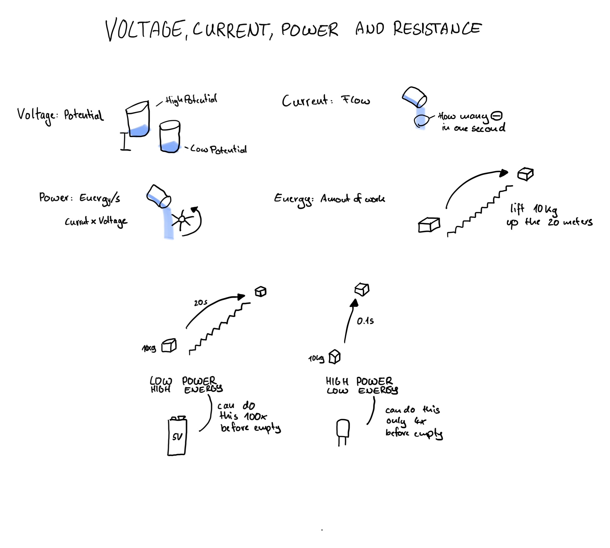

# Voltage, Current, Power and Energy

Understanding the basics of voltage, current, power and energy.

## Reflection
After my attempt to understand amplifiers I decided that it woul be smart to step back and rethink my approach.

### Approach
- Get back and understand the basics first
- Learn some math to calculate stuff

### Strategies
- Decide on what to learn about upfront
- Have some good ressources at hand
- Limit the amount of videos you are watching
- Try drawing things

## Try Circuit Bread
There is a website called [Circuit Bread](https://www.circuitbread.com) and they seem to have a nice collection of courses that have videos and written text available.

I will try their Circuits 101 Course and see how much I can learn from that.

## Voltage, Current, Power and Energy

[View Tutorial](https://www.circuitbread.com/tutorials/voltage-current-power-and-energy)

**Voltage - The potential**  
The electric potential between one place and another. How much electricity wants to move from one point to another. Measured in Volts.  
You have a voltage across something and voltage is always relative.

**Current - The flow**  
The current flow from one point to another. Literary based on how many electrons are moving per second. Measured in amps.

**Power - Energy over time**  
Work that us being done per second. In circuits this usually means the amount of heat given off by a circuit. Measured in Watts or joules per second.  
Power is current times voltage.

**Energy - Amount of work**  
The total amount of work done. There is not time component for this. Measured in Joules.

## Drawing

## Things I Have learned
- Voltage is potential and current is flow
- Power is Energy over time
- Batteries are more energy dense than capacitors (Can lift box 100m in air in one second, but total of 5000m before empty)
- Capacitors are more Power dense than Batteries (Can lift box 10m in air in one second, but total of 200m before empty)