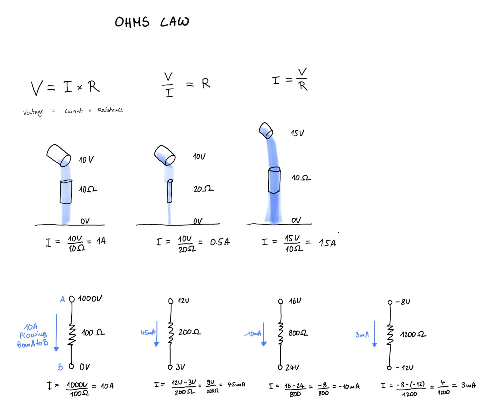

# Ohms Law

Ohms Law describes the relation between Voltage (V), Current (I) and Resistance (R) in a circuit.

[View Tutorial](https://www.circuitbread.com/tutorials/ohms-law-tutorial-with-easy-practice-problems)

## Voltage and Current are relative
Voltage can be postive and negative, depending on how you look at it. Negative voltage is just a lower potential than what is established as ground.
And current, a measurement of the flow of electrons, can also be positive or negative. This only depends in which way you are measuring.

## The equations is linear

This is a linear equation, so whenever you change one value, the others adjust accordingly.

## Extremes related to resistance

- When you have zero resistance, you get infitite Current. This is called a short circuit and should be avoided.
- When you have infitite resistance, you get zero current. This is called an open circuit and means that some things are not connected.

## Drawing

## Things I have learned
- There is current flow from on point to another, so you have a voltage across sometings
- It is a linear equation, so things change proportionally
- Voltage and current can be positive and negative, you just have to set a point of reference