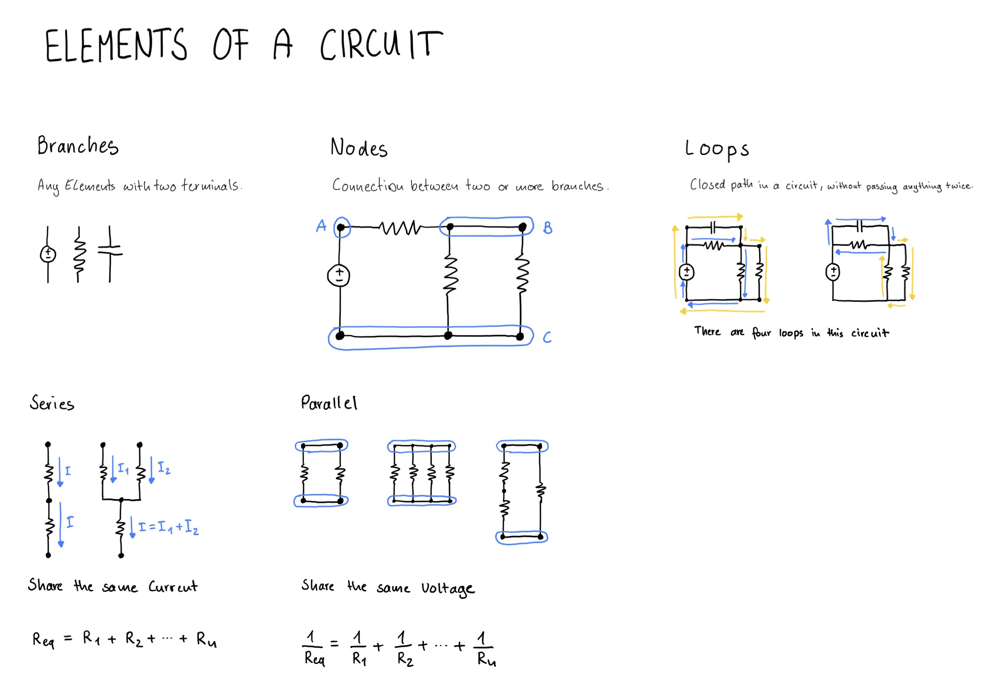

# Circuit Elements

A circuits consists of branches, nodes and loops, which can be in series or parallel.

[View Tutorial](https://www.circuitbread.com/tutorials/what-are-branches-nodes-and-loops-with-series-and-parallel-components)

## Branches
Electronic components with two terminals, like a battery, resistor or capacitor.

## Nodes
All terminals of a branch that are connected together. Like the postive terminal of a battery and one end of a resistor.

A node is the connection point between two or more branches.

## Loops
A loop is a closed path in a circuit. Closed means that it starts and ends at the same node, without passing through anything twice.

## Series and Parallel
Knowing about series and parallel lets you simplify circuits.

### Elements in Series
All Elements in series share the same current.

Calculating Resistance:

`Req = R1 + R2 + Rn`

The Resistance will always be higher that the value of the highest Resitor.

### Elements in Parallel
All Elements in parallel share the same voltage across them.

Calculating Resistance:

`1/Req = 1/R1 + 1/R2 + 1/Rn`  

The Resistance will always be lower than the value of the lowest Resistor.

## Drawing

## Things I have learned
- A branch is a components with two terminals
- Nodes can be quite large and include many components