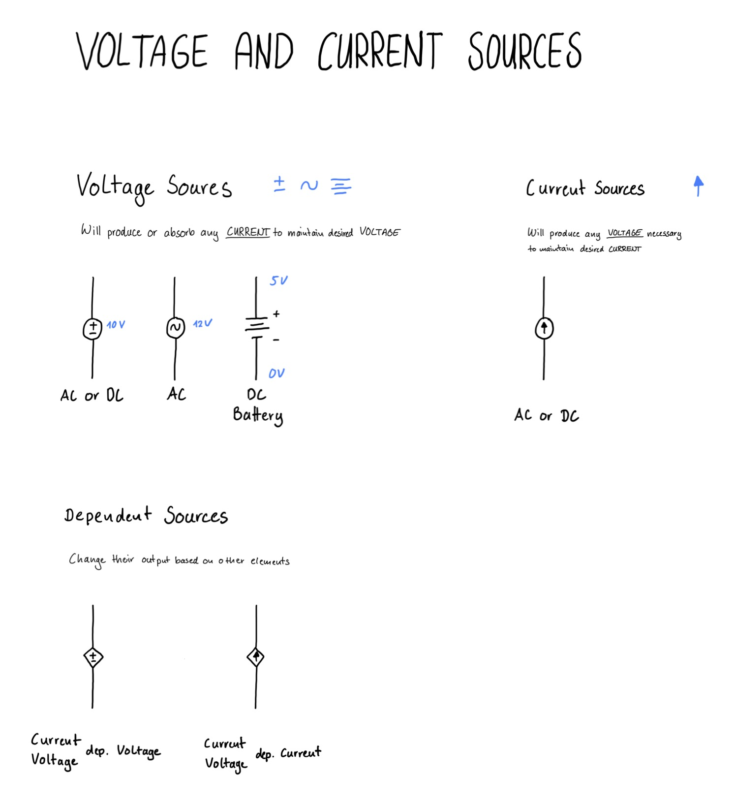

# Voltage and Current Sources

There are Voltage and Current Sources, which can both be independet or dependent on ther elements.

Power sources are active elements, meaning they can generate energy and absorb it. 
Passive elements can either absorb energy (resistors) or store/release energy (capacitors and inductors).

## Voltage Sources
An ideal voltage source will produce or absorb any current to maintain the rated voltage.

The are different symbols used to represent voltage sources:
- Circle with + and - in it (can represent any independent voltage source, whether AC or DC)
- Circle with Sinus in it (represents a AC Source, but can have an AC offset)
- Two or more lines (Represent a battery, which is always DC)

## Current Sources
An ideal current source will produce any voltage necessary to keep a constant current.
It is usually represented with a circle with an arrow inside.

## Dependent Sources
Sometimes there are dependent sources, which change their output based on other parts of the circuit.

Their symobls look like that:
- Diamond with + and - in it
- Diamond with Sinus in it

There are four common types of dependent power sources:
- Current controlled current source
- Current controlled voltage source
- Voltage controlled voltage source
- Voltage controlled current source

## Drawing

## Things I have learned
- There are different symbols for voltage sources
- There also current sources, but not so common
- There are dependend sources, which change their output based on other elements