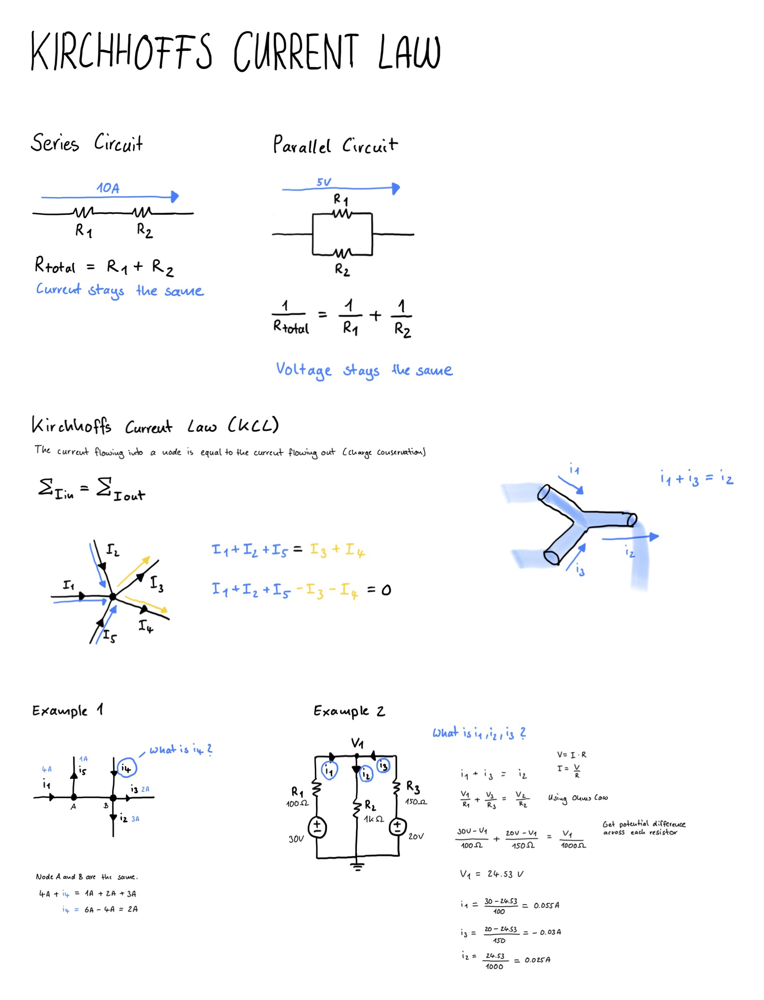
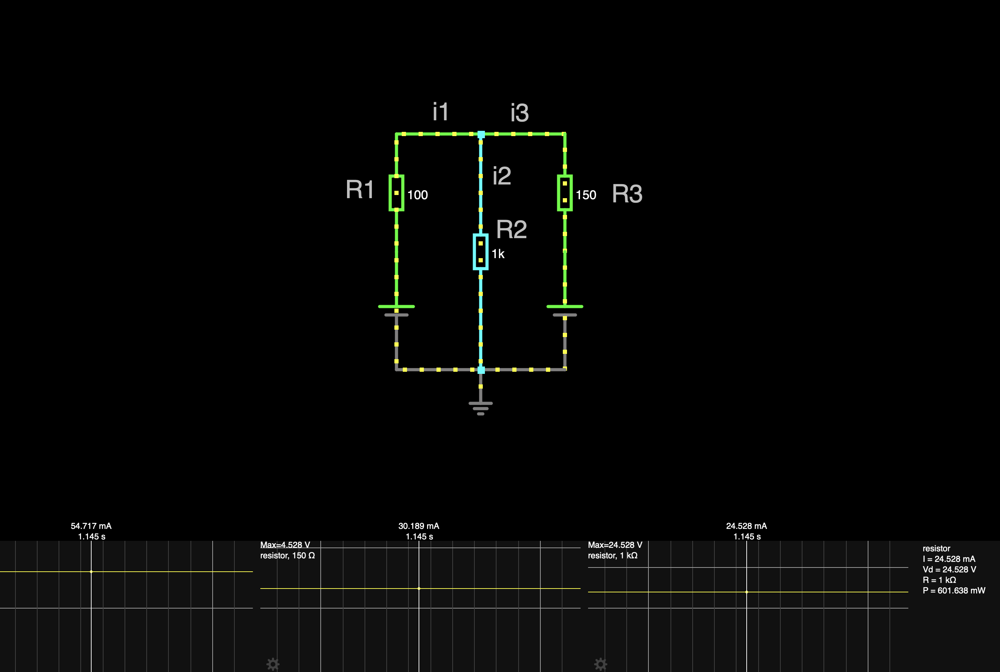

# Kirchhoffs Current Law

Kirchhoffs Current Law (KCL) is based on the principle of charge conservation and states that the sum of current flowing into a node is equal to the sum exiting it.

## Drawing

## Simulation
You can use a simulator to see the law in action and get the values for current directly in there.

[View Simulation](https://www.falstad.com/circuit/circuitjs.html?ctz=CQAgjCAMB0l3BWcMBMcUHYMGZIA4UA2ATmIxAUgoqoQFMBaMMAKADcQAWbFLvK7r2yE8UMZyq4xVGAhYAnLjxDDRgkCgSExYOCwDuS3pu0IwxrVAMVzGywmIXtkBRUd3T71Tsrs3vTn5-FRFpLio0MNlXMycbAKCqXT1DdUDaW3SrQ1i+WncslwBzeLzS3JkWAA8VPGwVMHJOMHqeAQ1OEAAlVhrCYRUUCEIRwc7OlE6u7GqKIhUEJEXtbAQ1Du6UWc5RyfrAiZ2uDYBLXrnWyE6EZpVIJtOtmpuIzmu1jofJkBOZgHtwCBCJ0BJBSMgoNAIBFAf9jsDxGDiNQYBAIAEVCwAdoEaDwRJIeiNEDMUA)

## Ressources
- [Circuit Bread - How to solve complicated circuits with kirchhoffs current law](https://www.circuitbread.com/tutorials/how-to-solve-complicated-circuits-with-kirchhoffs-current-law-kcl)
- [Circuit Bread - Solving circuits using kcl and kvl](https://www.circuitbread.com/tutorials/solving-circuits-using-kcl-and-kvl-dc-circuits)

## Things I have learned
- The KCL says what goes in must go out, at least for current
- You can calculate in which direction the current flows