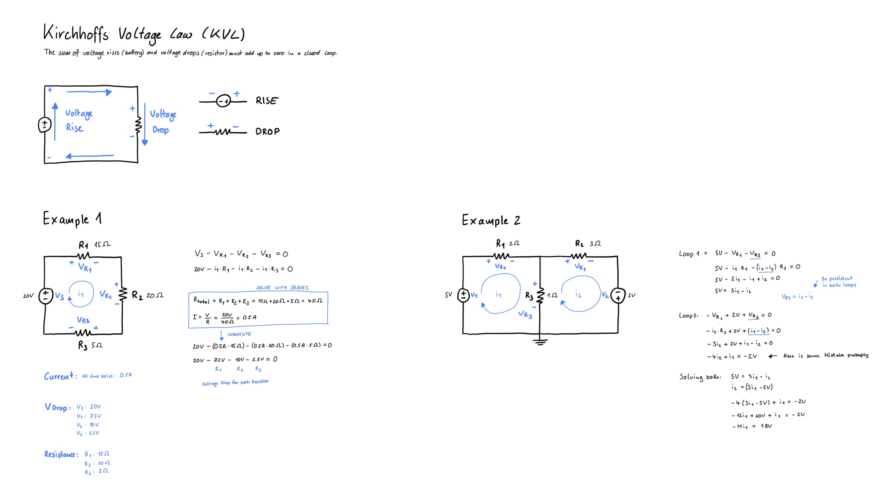
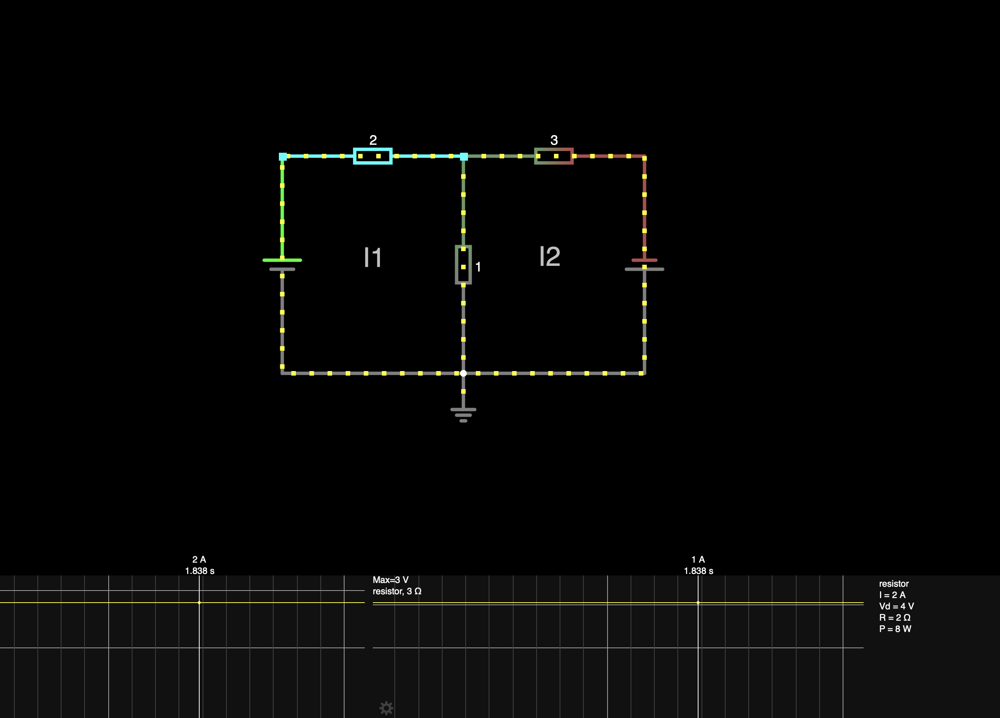

# Kichhoffs Voltage Law

Kirchhoffs Voltage Law (KVL) says that the sum of voltage rises (battery) and voltage drops (resistor) must add up to zero in a closed loop.

The loop must not include any other loop in it.

## Drawing

## Simulation
You can use a simulator to get the values as well.

[View Simulation](https://www.falstad.com/circuit/circuitjs.html?ctz=CQAgjCAMB0l3BWcA2aAOMB2ALGXyEw1sESQBmZEJBSagUwFowwAoANxGwE4qFk6PKpTRQx2OkjrToCVgCcuvCslEFhqsQCYFIdSrX9qAsW0X6RIDBtF1yHK2BuO+J6VzpaxMuQHclrnT6-NKs-sEm1sahAOZ6RiHxfNxeoQAexphcyHxoWdjI3FwgWtggAJJsGZhaXgVIOHWaZaUVOgD24HplgpDcRUjk0KklXfad5N3ifQPg0FQQXpP2QA)

## Ressources
- [Circuit Bread - How to solve complicated circuits with kirchhoffs voltage law](https://www.circuitbread.com/tutorials/how-to-solve-complicated-circuits-with-kirchhoffs-voltage-law-kvl)
- [Circuit Bread - Solving circuits using kcl and kvl](https://www.circuitbread.com/tutorials/solving-circuits-using-kcl-and-kvl-dc-circuits)

## Things I have learned
- Calculating those circuits is quite hard
- You can use a simulator for understanding those circuits