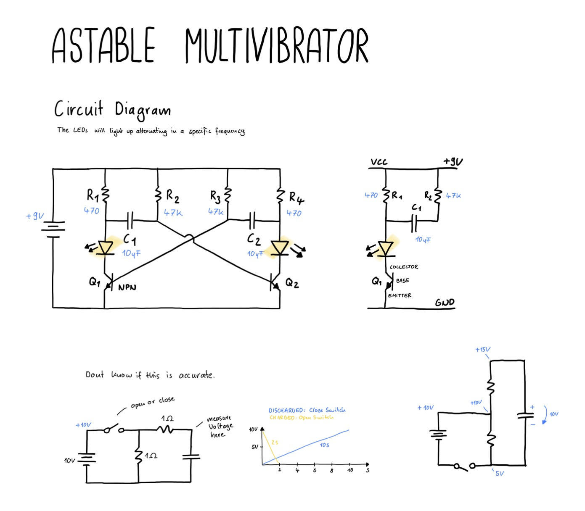

# Astable Multivibrator Circuit

The astable multivibrator circuit lights up two LEDs in alternation at a fixed frequency.

## The circuit
It uses a few resistors, some capacitors, two NPN Transistors (BJT) and two LEDs.
The LEDs are turned on by the charging and discharging of the capacitors.
It can be divided into two mirrored parts, each part consisting of two resistors (R1: 470, R2: 47k), that are hooked up to a capacitor (C1: 10 uF) for that.
The outer resistors (R1) we go to the LEDs, which then goes to the Collector of the BJT and the Emittor goes to Ground.
The inner Resistor (R2) connects to the base of the Transistor of the other side.

## How it works
As soon as the voltage on the base of the Transistor is more than around 0.6V (depending on the type) it lets current flow.
Then one light turns on, after a few seconds the capacitor has lost all its charge and then the other one turns on.
In there this should not work and both leds should be lit all the time. But dues to some tolerances in the components its seem sto work with that.

[View Simulation](https://www.falstad.com/circuit/circuitjs.html?ctz=CQAgjCAMB0l3BWckHTADgOzoJwDYBmddSLAJgBYQ8lbIQEBTAWjDACgAnBiqshPDypEq9CpkhdqFev0F4ZIEVBDj4UkrIEhNS9KNUS4G-CDk7TysRPYBjIXqoL6VqLHiQcX7z984d0ARBChQEmBRkOAjoYGRucBz2usq4gq4wHp5+2V4gzHjQ6AikhOhkKGB4lf4ZkByVcQi8jg4UCmYgACaMAGYAhgCuADYALsxDjJ3gKvQZ9XhxqS1LbXxdvYOj45PTs-EcI6qmFCStp-QQrASFRNi3J2BwBHHMFIV4kASQZD8UCDhBH5IR70br9YYjdiHfToVSnFbnXbQYooAgUMBhKqhAjtGB4fEoSCYMjkD4xKgg9bg0bsABuqjgDBJDK0gj2ihqM2R7AA7iyzNomnxtJI+UKBfJFOZRdJWTpGdLefK5UtFXyZPQEMzxVrYTKddrmhRTPrmrqLIJzTKluaVialcbBCd6Ml9FAlc5lic4bN2AB7Mz0XEM3LleL8FR8FwdWRKdhAA)

## Drawing

## Ressources
- [Learn Electronics - Classic circuits you should know: Astable Multivibrator](https://www.youtube.com/watch?v=EZ0YZcC84m4)
- [Skinny RND - The Astable Multivibrator](https://www.youtube.com/watch?v=oQ5YzUCo8Pg)
- [BBCircuits by Steve Morrison - Build and Astable Multivibrator circuit on a breadboard](https://www.youtube.com/watch?v=6k76Rbda6dw)
- [Vocademy - Astable Multivibrator: Answers to Questions](https://www.youtube.com/watch?v=9eRWKh7OOHw&t=1209s)
- [Build Electronic Circuits - How Astable Multivibrator Circuits Work](https://www.build-electronic-circuits.com/astable-multivibrator/)

## Other things I found along the way
- [Wokwi - An advanced mircocontroller simulator](https://wokwi.com)
- [Vocademy - An online course to learn electronics technology](https://vocademy.net)

## Things I have learned
- The astable multivibrator circuit is simple to build, but hard to understand
- There is some math needed and it takes time to get the details on how it works