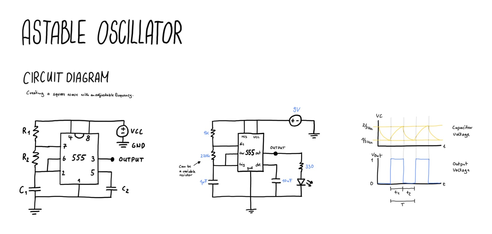

# Astable Oscialltor Circuit

Building a square wave generator with adjustable frequency using an astable osciallator circuit.

## NE555

The core of this circuit is an NE555 which is an integrated circuit that has three modes:

- Astable Mode (Oscillator Mode)
- Monostable Mode (Time Mode)
- Bistable Mode (Flip Flop Mode)

## Approach

This circuit is quite complex and I do not really know how it works. 
Maybe looking at it from different perspectives helps me understand it step by step.

## Drawing

## Ressources

Videos
- [Learn Electronics - Classic Circuits you should know: Tone generator](https://www.youtube.com/watch?v=KzXp4ycH0BQ&list=PLGhvWnPsCr5_n-9fFQM6Sa9BZir0wvm59&index=3)
- [Blueprint - Make a really simple square wave generator](https://www.youtube.com/watch?app=desktop&v=CTIr1a0xgRw&t=269s)
- [Organfairy - Making an NE555 based synthesizer](https://www.youtube.com/watch?v=IaaZ8pJu-yM)
- [Friendy Wire - NE555 tutorial: Three useful circuits](https://www.youtube.com/watch?v=l5LzERjkux0)
- [Andrew Sink - Oskitone Poly555 Analog Synth](https://www.youtube.com/watch?v=YcFjmL8s72Y)

Text
- [Electronics Tutorials - 555 Osciallator Tutorial](https://www.electronics-tutorials.ws/waveforms/555_oscillator.html)
- [Antonio Circuits - How to design a 555 astable oscialltor circuit](https://anitocircuits.com/how-to-design-555-astable-oscillator-circuit/)

## Things I found along the way

- [Every Circuit](https://everycircuit.com) is an tool to design, simulate and share circuits online
- [Oskitone](https://www.oskitone.com) has DIY electronic musical instruments and soldering kits

## Things I have learned
- It is ok to build a circuit without understanding how it works
- The inner workings of most circuits seem quite complex