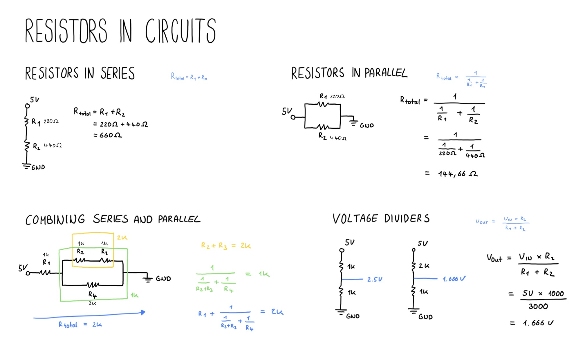

# Resistor Circuits

Resistors can be combined in a circuit to let current flow in a specific way.

## Resistors in Series
The current has to flow through every resistor, so it adds up. 
The total resistance is always higher than the value of the highest resistor.

Just add up the resistance of all resistors. 

`Rtotal = R1 + R2 + Rn`

## Resistors in Parallel
The current flow through every way possible at the same time, so it is shared. 
The total resistance is always lower than the value of the lowest resistor.

Take the inverse of the addition of all inverses of all resistors. 

`Rtotal = 1 / (1/R1 + 1/R2 + 1/Rn)`

## Both Series and Parallel
To calculate the total resistance you can simplify by identifying series and parallel circuit and work you way up from the smallest part to the largest.

## Voltage Divides
When you have a series of two resistors the voltage in between them is lower compared to the positive terminal.
When both resistors are the same value, the voltage is just half in the center.

`Vout = (Vin * R2) / (R1 + R2)`

## Drawing

## Ressources
- [Afrotechmods - The best multimeter tutorial](https://www.youtube.com/watch?v=bF3OyQ3HwfU)
- [Circuit Bread - Getting started with a multimeter](https://www.youtube.com/watch?v=2ScCNtJmr8w)
- [Simple Electronics - How to use a multimeter](https://www.youtube.com/watch?v=EvAq9zqRB5I)

## Things I have learned
- Getting a negative value when measuring voltage with a multimeter means you have polarity flipped around
- All components have tolerances, meaning their actual values can be different from what is labeled