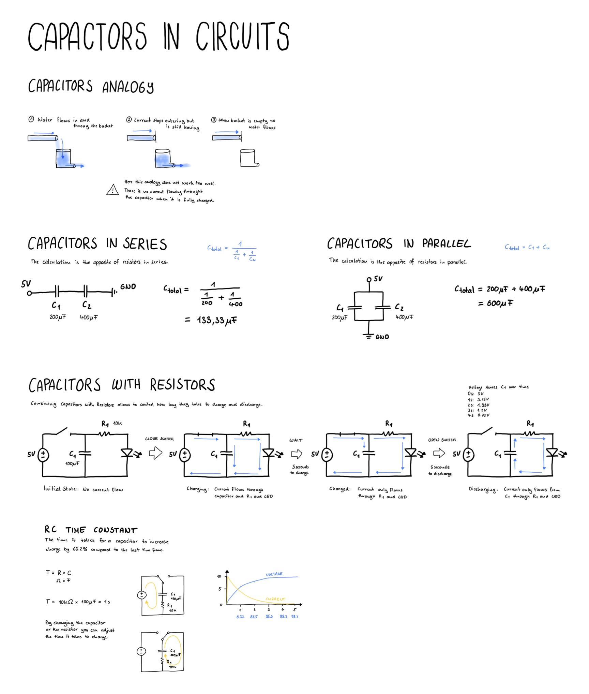

# Capacitor Circuits

Capacitors can be combined with resistors to adjust the time they take to charge and discharge.

## Capacitors and Water Analogy
Sometimes a capacitor is depicted as a water bucket with an opening at the bottom. 
It gets filled up and lets water through and when no water is coming to fill, it will release water until it is empty.

This is almost good, but capacitors only let current flow through while they are charging.

## Capacitors in Series
To calculate the capacitance of capacitors in series it is the opposite as with resistors in series.

`Ctotal = 1 / (1/C1 + 1/C2 + 1/Cn)`

## Capacitors in Parallel

To calculate the capacitance of capacitors in parallel it is the opposite as with resistors in parallel.
`Ctotal = C1 + C2 + Cn`

## Capacitors with Resistors
A common configuaration is to use capacitors in series with resistors. 
By adjusting either the resistance or capacitance we can control how long the capactor takes to charge.

### RC Time Constant
The RC time constant describes the time it takes for a capacitor to charge or discharge significantly in an RC circuit.

`T = R x C`

R is resistance in ohms  
C is capacitance in farads  
T is measured in seconds  

During charging each interval charges to 63.2% of the difference between its current voltage and the maximum voltage.
After 5 intervals it reaches about 99.3% of the supply voltage and is effectively fully charged.

For discharging it is different, there each interal decreases the charge by 36.8 % compared to the last interval

During discharging each interval discharges to 36.8% of its current value.
After 5 intervals, it is effectively discharged, with less than 1% of its initial charge remaining.

## Drawing

## Things I have learned
- By adjusting capacitance or resistance values you can adjust the time it takes for a capacitor to charge
- A capacitor charges by 63.2% with each interval