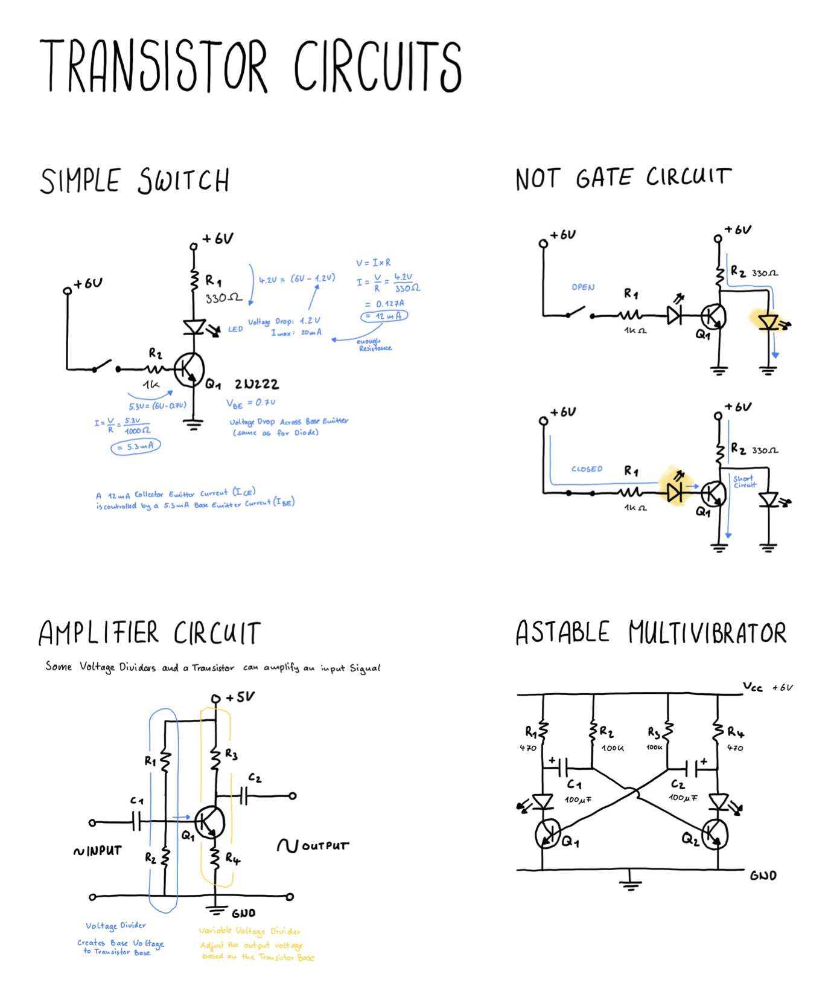

# Transistor Circuits

A transistor can be used to create switches, amplifiers and osciallator circuits.

## Simple Switch
A transistor can be used as a simple switch that takes a small current to control a larger current.

[View Simulation](https://www.falstad.com/circuit/circuitjs.html?ctz=CQAgjCAMB0l3BWcMBMcUHYMGZIA4UA2ATmIxAUgoqoQFMBaMMAKACUKAWTisFLnrh5UqnKoSiSYCFgGcBvfoQQSEfKSABmAQwA2suiwBOIZavUY8PNfyph4LAC4hL19Xmz8bkiDELYMQgJOYk8wIMJuKGhCQM4wBDw8SO4EBBR+eyoAEzodAFddRxZw-g9+bCCQcpAQiX5cgqKGXTps8A0YSFYTGpQVas8QSrxJbFx2Qf5+iRqwYltJMVNO6BkAcymKFFGahAWpFgB7WtNhWshSahhfEH5BY7uzpcviZGjIfo7p4ZYgA)

## NOT Gate
A transistor can be used to create a NOT Gate by having a simple switch circuit, where the Collector Emittor Circuit has a LED or similar at the Collector.

[View Simulation](https://www.falstad.com/circuit/circuitjs.html?ctz=CQAgjCAMB0l3BWcMBMcUHYMGZIA4UA2ATmIxAUgoqoQFMBaMMAKACUKwVPuEuRs2QlBEAWKsKpToCFgGceiwvkVSQAMwCGAGzl0WAJxDK8ijJFGrkcFgBcQGPJb7c82XvyoQYhTM0J4GChglJDu2FDQhI6E-mQhhLGiEGBwIAAmdFoArtq2hiBu3NhOhe4gosSSArjsZcWlRTXVVOLGItKyAOb1FCimTQjE3FIsYL4OFmalLiDcmTl5DNp06eAdkZCs467llcJVrVVzGVmaubbLq+tqMFssPYcVx09DI1AsAPYOxpatkKRqHcUEgqNxyNgvoVfmIAcQ5jJNiD1q4BCwgA)

## Amplifier

A transistor can be used as an amplifier when you have four resistors that create voltage dividers. 
The first one sets the voltage at the Base of the Transistor. The other one includes the Collector 
Emitter circuit of the transistor, which then acts as a variable potentiometer to amplify the incoming singal.

[View Simulation](https://www.falstad.com/circuit/circuitjs.html?ctz=CQAgjCAMB0l3BWcBOaAOAbAdgCwCYsBmHMBMHZNQkBSGmuhAUwFowwAoAJRCzzsKQcvfiDw46kkBLFTJ0BBwBOIgUNXS4UcPEgcA7hsHCMCDCGNRlIU+cu3pYc3Xa6OAFxtnH5vnRLO4CAsqJAIeGBYkORoWJQYeNQwCMiEWBhOYITItKbROnQAJkwAZgCGAK4ANu7WftKEeBoIOMIu8NYOAV7mLW0FcBwAxj0+NBj+TtJQsLoUyAuLS0vmYNATkMgUeAiYcBg4CEmzEHoj9RJ0aFOX0zC6QstPK2KwaEetkHHiGKY4WDM4KcDKM+s1WlYAObg4T1BDpbR6HhmSa9MBNbouEBoeRIOQKDgAeWxNy0mGEt0k1mu5luNJoEPaDxBcIh9LBegA9uAIAdtBIFjMEnjZpBspBhdomuwLBxueibP0BWhZDMIOqOEA)

## Astable Multivibrator

A transistor can be used to create an osciallating signal by using two pairs of two resistors, a capacitor, and LED and a resistor.
The Base of each transistor is connected to one side of the opposite Capacitor terminal.
Depending on which Capacitor and Resistor Valuse are used it osciallates at a specific frequency.

[View Simulation](https://www.falstad.com/circuit/circuitjs.html?ctz=CQAgjCAMB0l3BWcBOaAOAbAdgCwCYsBmHMBMHZNQkBDGmyGgUwFowwAoAJRo0b0hoQONP0FQJORnUazoCDgCdeYobUaEBkrJA4B3FSAFCMtI+N3LTdYyGshNs8PF0Dkhx3bOecUWC+RAoOCQ9zBoLFEsbDAMPHxIQlM-OAhGTli8Dy11YTgjEAATJgAzAEMAVwAbABcWKqZC8Ak5SE4au3ESOlzuiTT5IjQsLFo0NGQ2tDAhGFMELGQFwkJIKTbILGdGYvLqmv1DHE0j5BlD+1tRrNtLEGvzIQfPdJdDh9s0EUeoJRAvoSfb4vYQ6Dhuf7ArTPLS+GAuSChJFBGjQYiEZCkPgIOCYeJIeFtfocTKQoSeAF5fhFUqVWr1RrNJzw9ogTFZPqUvrpEAsBDQSbWDFYMCYwhULbwxYIQjkXAYZBEZB4WLbGl7WqHLknLlnX4GPhCPow2QXbxadnCVW6Ay9PW684Ac1OdAorr1poA9sI7HC8oFnH40gVfIQON6wNQMH6pAGCdAIBAspGHBwgA)

## Drawing

## Things I have learned
- Building real circuits is really different from a simulation
- There are a lot of details in the specifications of individual components
- Choosing the right values for a circuit is complex