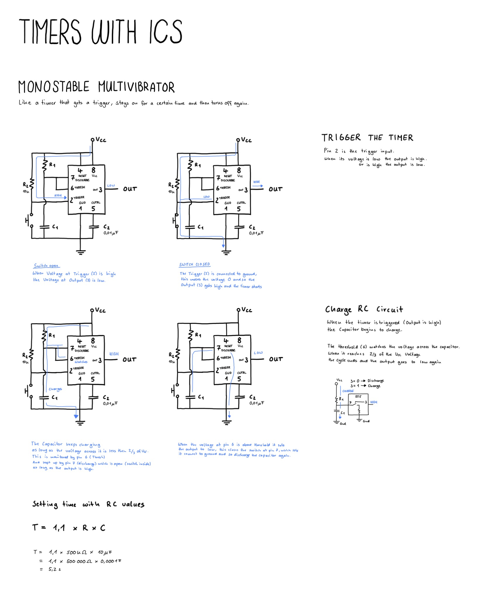

# Timer IC

Building a simple timer using an integrated circuit.

## NE555 in Monostable Mode

The NE555 is an IC that can be used in different ways to produce time based things.

In monostable mode it works like a time that receives a trigger and outputs a high signal as long as it is running, then it goes to zero again.

The time it stays high is determined with an RC circuit and the following calculation

`T = 1.1 * R * C`

## Drawing

## Things I have learned
- This is more complicated than I thought
- Understanding the details of how things work is complex