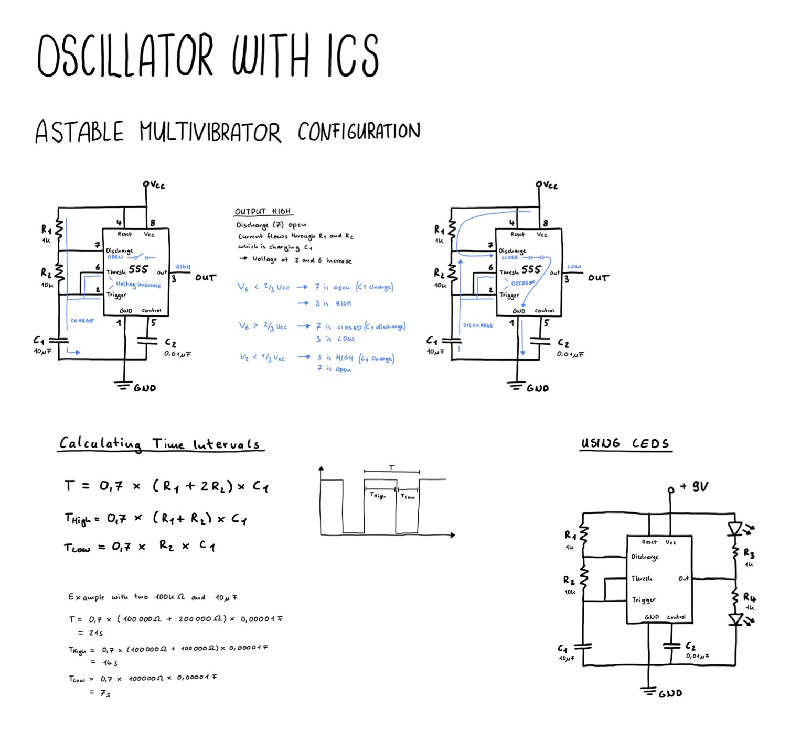

# Oscillator IC

Building a simple oscillator using an integrated circuit.

## Using the NE555 in Astable Mode as an Oscillator
The value of the output determines if the discharge is connected to ground. 

- When out is high the discharge is not connected to ground. This means that the capacitor charges and voltage rises at threshold and trigger pin.
- When the voltage at threshold is greater than 2/3 of Vcc the output is low. This means that discharge is connected to ground. Which lets the capacitor discharge again.
- When the voltage at trigger is lower than 1/3 of Vcc it turn the output high again. This means that discharge is not connected to ground. Which charges the capacitor.

This way the circuits osciallates between the two states.

[View Simulation](https://www.falstad.com/circuit/circuitjs.html?ctz=CQAgjCAMB0l3BWcBOaAOAbAdgCwCYsBmHMBMHZNQkBDGmyGgUwFowwAoAJRDThDw5GfRmCx1GjISGRQ5MBBwDmvQnhAU6VdQhw55HMBiRE6BdZn3mQW6MmQEMkQoQxVCaLIoDuvfoMY3NAFpSA4AJxs0YICo4MJIfVF4Dl8gkAT9UwzEqFSQbNdg7KFJfJL+dNK8yPTMuI1+ZJSAYwbqquQ6JNh4CBxYB2JPIQxSDB64CDC2kQ01PykujXBWYIle6fzOrX5NPN9teYsF-bDDveWjs-y52MsQssOJx94X+vO3q2kHGNDb07LX4aZafB4uOjAiE1GR4eKuWExLDqZphSJQhHA6qowwYdTA2IE5ECEAAEyYADMAIYAVwANgAXFh0pik8DyKCwThGfFwxqMLHLdTk6n0pkstnTeRcjgAe3A6ySjXs4EksCQUgVGQKciwGQ4QA)


## Calculating the Frequency
The output of the oscillation is a square wave and the frequency can be adjusted by changing the values of the resistors and the capacitator.

```
T = 0.7 * (R1 + 2R2) * C1
T High = 0.7 * (R1 + R2) * C1
T Low = 0.7 * R2 * C1
```

## Drawing




## Ressources
- [The Geek Pub Extras - 555 Timer (astable mode)](https://www.youtube.com/watch?v=FodORXu-Jjk)
- [Friendly Wire - NE555 tutorial: Three useful circuits](https://www.youtube.com/watch?v=l5LzERjkux0)
- [Great Scott - Electronic Basics 26: 555 Timer IC](https://www.youtube.com/watch?v=fLaexx-NMj8&t=66s)
- [Circuit Bread - 555 Timers Astable Multivibrator Configuration](https://www.youtube.com/watch?v=APghHcA-MOI)