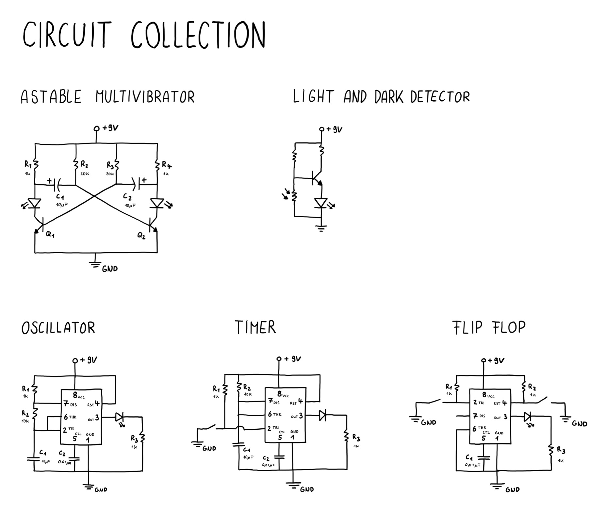

# Circuit Collection

This is a collection of all circuits I have done so far.

- Astable Multivibrator (Two Transistors and Capacitors)
- Oscillator (NE555 in Astable Mode)
- Timer (NE555 in Monostable Mode)
- Flip Flop (NE555 in Bistable Mode)
- Light and Dark Detector (Transistor and Resistor)

## Drawing

## Astable Multivibrator
The R1 is the lower Resistor and is mostly current limiting for the LED.

When using a polarized Capactitor pay attention to connect the anode to that Resistor.

[View Simulation](https://www.falstad.com/circuit/circuitjs.html?ctz=CQAgjCAMB0l3BWEAOAnLAzKgbBsqB2AJiMgwwBYQFJrraEBTAWjDACgAlEA7ZEIgmwg+-QcNq0KtVFDkwE7AOY8+1MER6QqCDfPYAnVWKHGQGBJtph47AO5nxKCiYmHnrj+ctzStsNiavPwWQWoUGJqaACaMAGYAhgCuADYALswpjNHg8lCwHGlaVBQuZqX81iCsMDYYcMjYgS5CqJqs0BpE2G3EkKjIFAR4GOBwILGJqWn25dhUwepW7AGaNpAhPuv8EVET8cnpmdm5kvmQHEZtntfeVgIXcLO3TtsCppDub68Nd3LrnwcgxuRE8nyKqFKIAqYw20LKVQU2GGlAIyCIlEGYAwlWg2Bo0go80oTVIGGE632U3SszeRKob10ywciyZsP4bMBxXh-FuoSgs2Bf0hJQR7FIskW-KF-KoMHgFxQ0FRqFQAWIRAIkCESHlius4v67OFoL+ctg8AgRGgOAiQ0guEEbGwED1rvA7CAA)

## Oscillator
Using an NE555 in astable mode creates an oscillator.

It is important to have a small capacitor at the control pin as well.

When you want to add a speaker just Connect the output pin to the positive part of the speaker and the negative part to ground.

[View Simulation](https://www.falstad.com/circuit/circuitjs.html?ctz=CQAgjCAMB0l5YCsA2ATIkyDM0DsBOfZADgBYx85FJl8Rr77J6BTAWjDACgAlEXRKhCpcQgUNSRiUGaWZ1mi6Ii5hkGEtKyRSIYmpDbdyKFwDu-QcNF6DIoZHO2T954awnHaofpMfp+GBC-sIgACYsAGYAhgCuADYALmzxLGHgMkoIXABOIIHBJPlB9KS6zGDwTrhkpboFdaYWNbqIZZZCbeVOmu4m6n4eTR3WQgOjpnnjWEPjcorg8I4WvaRYY8TS88OrcJgoINuOAMb7JtvjXYdQsEuE9w+PhODQQchBqFiVuFg1WIhYG5wCDLfi1UjIXQtRqOADmZ0al3wDmG4kRByuJxGEKhViu5VgEDAeDknEkUhqSF8QIQkwRrmmQwqVQA9uBAZDZJBnpUaV90DIhGBAVguGzjOVDty6KhlECghgIEJdKKgA)

## Timer
Use a pullup Resistor to keep the voltage high at the trigger pin.

Add a switch, so wehn it is pressed it creates a connection to ground, which activates the timer.

[View Simulation](https://www.falstad.com/circuit/circuitjs.html?ctz=CQAgjCAMB0l5YCsA2ATIkyDM0DsBOfZADgBYx85FJl8Rr77J6BTAWjDACgAlEXRKhCpcQgUNSRiUGaWZ1mi6Ii5hkGEtKyRSIYmpDbdyKFwDu-QcNF6DIoZHO2T954awnHaofpMfp+GBC-sIgACYsAGYAhgCuADYALmzxLGHgMkoIXABOIIHBJPlB9KS6zGDwTrhkpboFdaYWNbqIZZZCbeVOmu4m6n4eTR3WQgOjw+OkWGMofcMtIKTIuotdpgDmmHPr44j4DgtWuzvtjgDGI8urx+3lsBCI0Fi4YOTTiIjE+y-3cBCOPLjVzjLBDCrwRwWKYzTDEaTTBxcS4w2YmdZ-eAA2BSQiVXGBODEfDwqA4gE9UlyZj7ITU0wAZ3oByWcHoJXpFRAiRysRYuWZdLZtImELgThFILmrkcW0QHOFHOIilMAHtwMwVrJIIQNWTpJq9VhwAaTYYlrJDFwgA)

## Flip Flop
Connect a pullup with switch to the trigger and another to the reset pin.

This lets you set the output high when pressing one switch or low by pressing the other one.

The discharge pin is unused and the threshold pin is connected to ground.

[View Simulation](https://www.falstad.com/circuit/circuitjs.html?ctz=CQAgjCAMB0l3BWcMBMcUHYMGZIA4UA2ATmIxAUgoqoQFMBaMMAKACUQMEUQU89O3XigAsUcSNriqMBCzCEkhfiGxoQeBavWEQI6KULKwcTcTAjMLAO6c8YkXioZ7FQjJt2xCd4J4+PAGM-PScQgL1wRgFsaGx4hMSkqFhICEhPZQERRxAstw9bfIiuf18MgHMvAur3AQ8FHk1dbFc8YhbXHgATOgAzAEMAVwAbABcGEbpu8GkUtJYAJw0O1TbViKoTOE8Xb1923U3doT4BBGIeM6glikveFQueES0t+E8nvS18l90MgGc7s8tAgwMC-rMxoshnQWFVQeCKGC9IQxIUQtdLgJrhllliHgJ8dghG8drZmqohESSSxAdSeCZRJSeFsQFCYXDkEziQzIEzJDIbgB7cDYPJovSQUjUGBwQgoJBUXRgMVi+oaVTgdVgGIsIA)

## Light and Dark Detector
When you place the Photoresistor second in the voltage divider at the base of the transistor it lights the LED when it is less light.

When you place it first, you create the opposite behavior. Menaing the LED is on when ther is more light.

[View Simulation](https://www.falstad.com/circuit/circuitjs.html?ctz=CQAgjCAMB0l3BWcMBMcUHYMGZIA4UA2ATmIxAUgoqoQFMBaMMAKACUQNC8Rs1PuIFAkJQxAFirExVGAhYBzATwQoeXFcRQyWAJ2W9+GkJNlC0cFmELbj4vgdU9tAEzoAzAIYBXADYAXBl86F3AZKFhWf05+cWsDONEqCDk8cRQUbARcDEoMYjSIwnwwBHECYmw8axtsZCo3Lz9-PRiqRLbDMzB4SBYAd06+KmNhqBZsDHFOjox+JxlYOAgAGQBLBQALfwAdAGcAIV0N7YA7Oj29gc6F4wW+gHtqQmn2yFJkCLhsMGExbSQ2BYTzqLwk72kSBgcBsSAg2jqQKAA)

## Things I have learned
- It always takes longer than expected to build this
- You need to pay attention to the details of a circuit