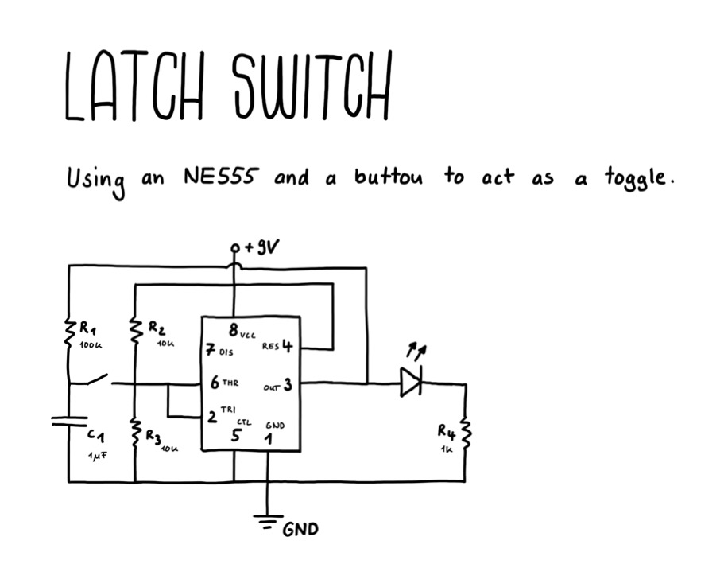

# Latch Switch

Using a NE555 in bistable mode to act as a latch switch or better known as a toggle button.

## Simulation

[View Simulation](https://www.falstad.com/circuit/circuitjs.html?ctz=CQAgjCAMB0l3BWcAOZ0AsBOAbJyAmAZm3UPUkxAUqQUioFMBaMMAKACUQB2fe-fOh59w2euJDkQlCTARsw2JEuwh8CVd2JqNIVYQyRs2brnStsrbt2bI2Acx4J8kkk5cIwL8WwDu7yUUA9DdIP2F+QR5kIQEhMP9uGLUopNjUKHC0kEIRZFyckTDFF3yXXPpkHEL+EAATBgAzAEMAVwAbABcmdoY68ChBmEh2ACcQKv086pD48HhwydchbmdlzP8VHLWtwmSEvV1CHchkbe82cbEz45drlLmweAP7uIiHzKvT871v2cGngtNn83KsXP8wgBnKheH73W4AkCdUatBiXGHlNaeFx8M70QFAjFqb5lYl4tgAYyJCOx63isGeEGGkDIRm4rBGXnwYA01igDKZ4Vp-3uEMWBVxEwKFUyQA)

## Drawing

## Ressources

- [Learnelectronics - Classic Circuits you should know: Latch Switch](https://www.youtube.com/watch?v=NQfTIZEt8aE&list=PLGhvWnPsCr5_n-9fFQM6Sa9BZir0wvm59&index=4)