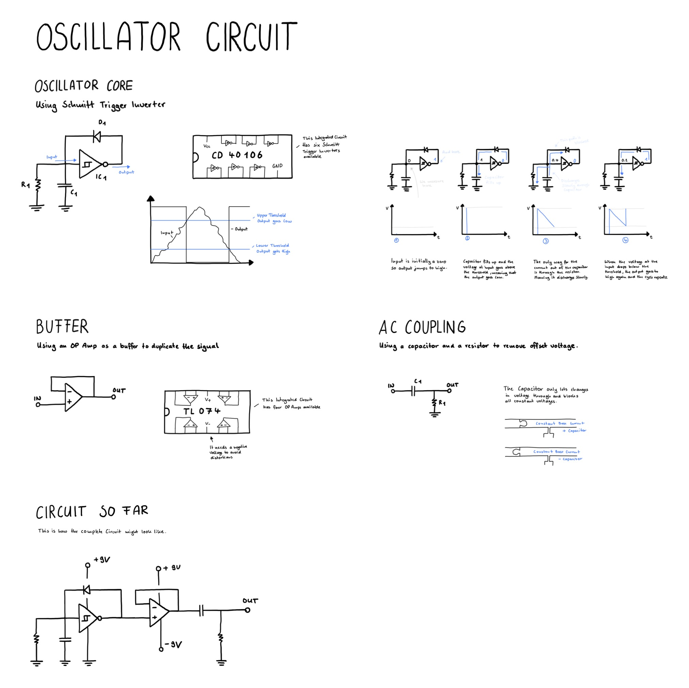

# Oscillator Circuit

Building a simple oscillator circuit using the CD40106 IC.

## Elements of the circuit

### Oscillator Core 

The oscillator core is made from a schmitt trigger inverter (using an CD40106) whose output is connected through a diode to the input. 
At that node there is a capacitor and a resistor, both connected to ground.

The Schmitt Trigger Inverter basically inverts the signal, but it does it with a certain threshold added. 
It outputs low, when the input is above certain upper threshold and high, when it is below a certain lower threshold.

When the input is high (and the output is low) the capacitor charges up quickly and then releases its current through the resistor.
At some point, when it is below a certain threshold, the output is high again and the cycle repeats.

### Buffer 

When we would use some signal from the inverter circuit we would destroy it. 
To avoid this we use an op amp to create a duplicate of the signal.

### AC Coupling 

Setting the center of the wave to zero using AC Coupling

The voltage coming out of the OP Amp is osciallating which is great, but it might be offset. 
This can damage our speakers, so we need to center it around zero again.

To do this we pass it through a capacitor and add a resistor to ground after that.
The capacitor lets oscillating current pass and block direct current.
This means we only get the oscillating, but centered around the voltage we want.

## Drawing

## Things I have learned

- A Buffer made from an OP Amp can duplicate a signal
- To AC Couple a signal you can use a capacitor and a resistor