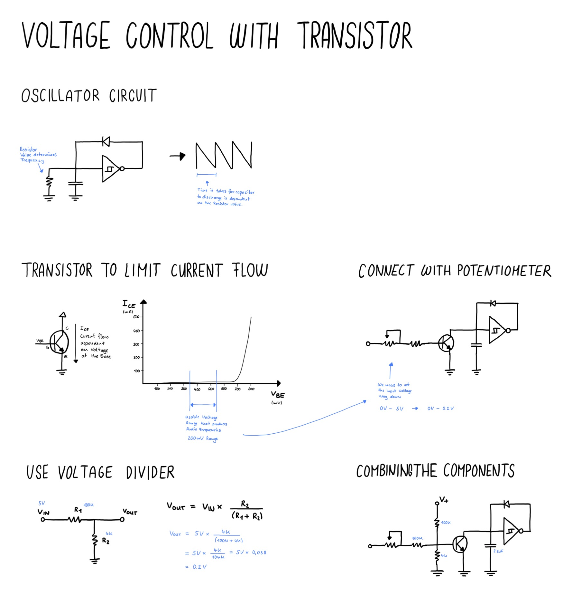

# Voltage Control with Transistor

Adjusting the Frequency of the CD40106 Oscillator with a Transistor

## The Oscillator Circuit

Its is Creating a Saw Wave witha diode pointing from out to in.

At that input node is a capacitor and a resistor, both connected to ground.

## Swap Resistor with Resistor to control discharge time

Add a Transistor instead of the resistor to adjust the current flow.

Connect the whiper of a potentiometer to the base of teh transistor to adjust its openness.

Add a 100k resistor in between to prevent from too much current goin to the transistor.

### Reducing Volate Range

The usable voltage range at the base of the transistor is very small, so we need to reduce it.

We need to reduce it by a factor of 25.

This means we add a voltage divide with the first resistor being 100k and the second 4k (100/4 = 25)

### Shifting Voltage

The voltage we have created now is in the correct range, but below the threshold of the transistor

## Voltage Divider

Two resistors in series going to ground

Input is at R1 

Output is at junktion between R1 and R2

```
Vout = Vin x R2/(R1 + R2)
```

### Examples

Vin = 9V, R1 = 100k, R2 = 100k
Vout = 9V x 100k / 100k = 9V x 0.5 = 4.5V

Vin = 9V, R1 = 100k, R2 = 40k
Vout = 9V x 40k / 140k = 9V x 0.285 = 2.6V 

## Drawing



## Things I have learned along the way

- Choosing which components to get is not easy
- Building real circuits is important