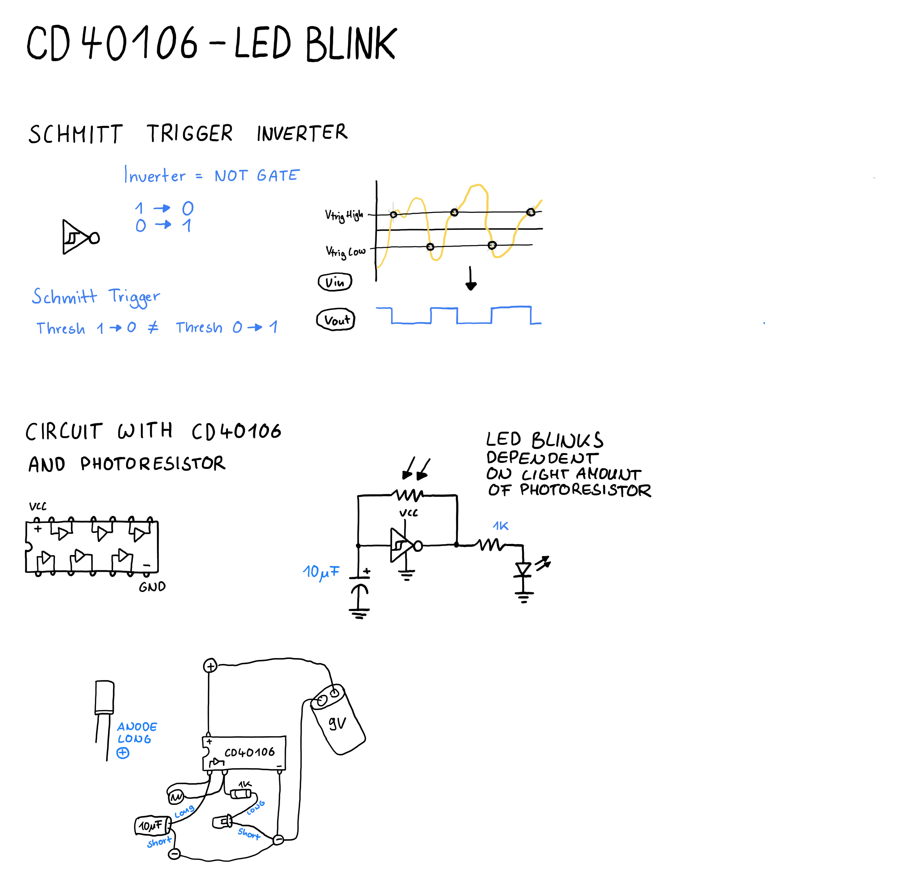

# Blink LED using an CD40106

Was on an event and saw [Corazon De Robota](https://corazonderobota.art) performing live audio circuit building.

Found [Seth D. Thorn](https://www.seththorn.net) on social media who did something similar. 

He teaches about that topic on [Glitch'n](https://www.glitchn.net) in small compact videos.

## Glitchn Course

The course is very minimal and has little explanation so my motivation is to go through every chapter and research a bit more information about each topic covered.

## Schmitt Trigger Inverter

The first chapter is about building a small oscillator that blinks and LED.

It is using the `CD40106` which is a hex schmitt trigger inverter.

A schmitt trigger inverter is a type of NOT gate (flips input) that has different thresholds for high to low and low to high (hysteresis).

By adding a resistor and a capacitor you can make it osciallate.

In this example we use a 10uF capacitor and photoresistor resistor to make an LED blink at different frequencies.

We could also change the capacitance to alter it, but this is way harder to do than just using something (potentiometer, ldr, or similar) that can change resistance.

## Drawing

## Learnings

- It helps to just build a circuit first without understanding how it works in great detail
- You tend to forget thinsg quickly when you do not practice it
