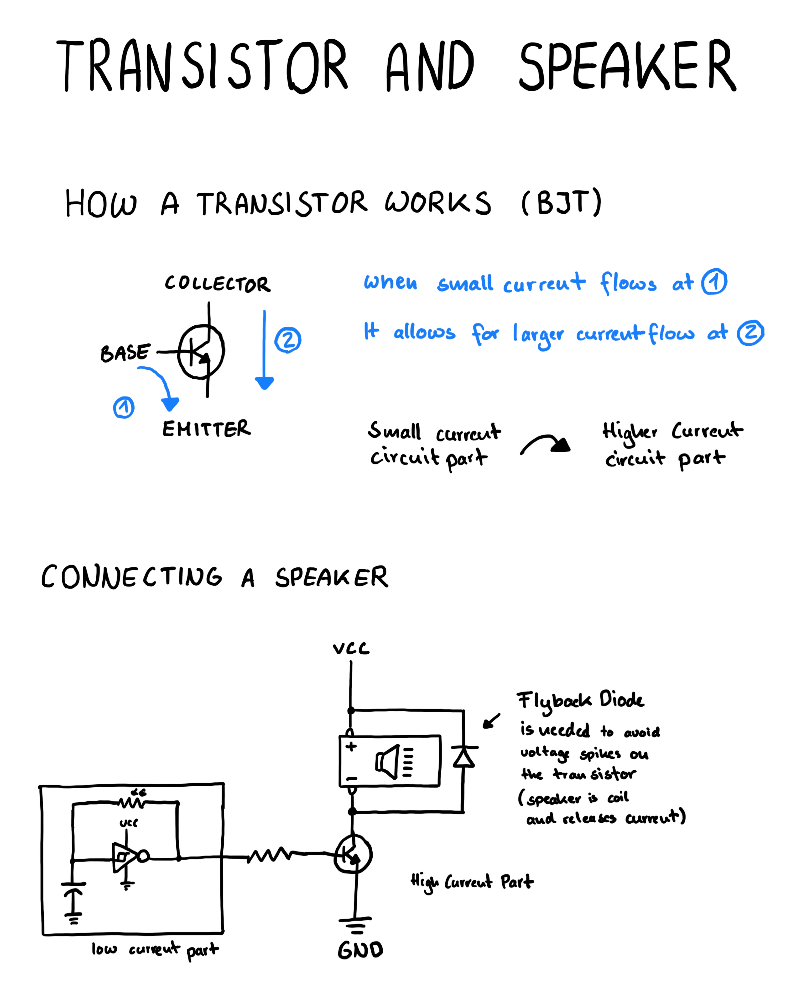

# Using a transistor to connect a speaker

The ch40106 circuit can make an led blink, but this signal can drive a speaker as well.

In [Lesson 2 of day 1](https://www.glitchn.net/course/lesson-2-make-some-clicks) they teach just that by adding an audio jack.

I only have some really small speakers in my electronics assortment so I need to learn how to work with them.

The problem is that the current it outputs is pretty low, so connecting a speaker directly won`t do much.

In order to fix that I need to connect a low current part of the circuit to one with a higher current.

This can be done with a [transistor](https://www.build-electronic-circuits.com/how-transistors-work/).

## Note

I did find a ressource called LEAP that has a lot of nice tutorials on [similar circuits](https://github.com/tardate/LittleArduinoProjects/tree/main/Electronics101/CD40106/SchmittOscillator) as well.

## Drawing

## Learnings

- Use a transistor to drive a high current part of a circuit with lower current
- Flyback diodes are used to reduce voltage spikes from coils such as those in a speaker
