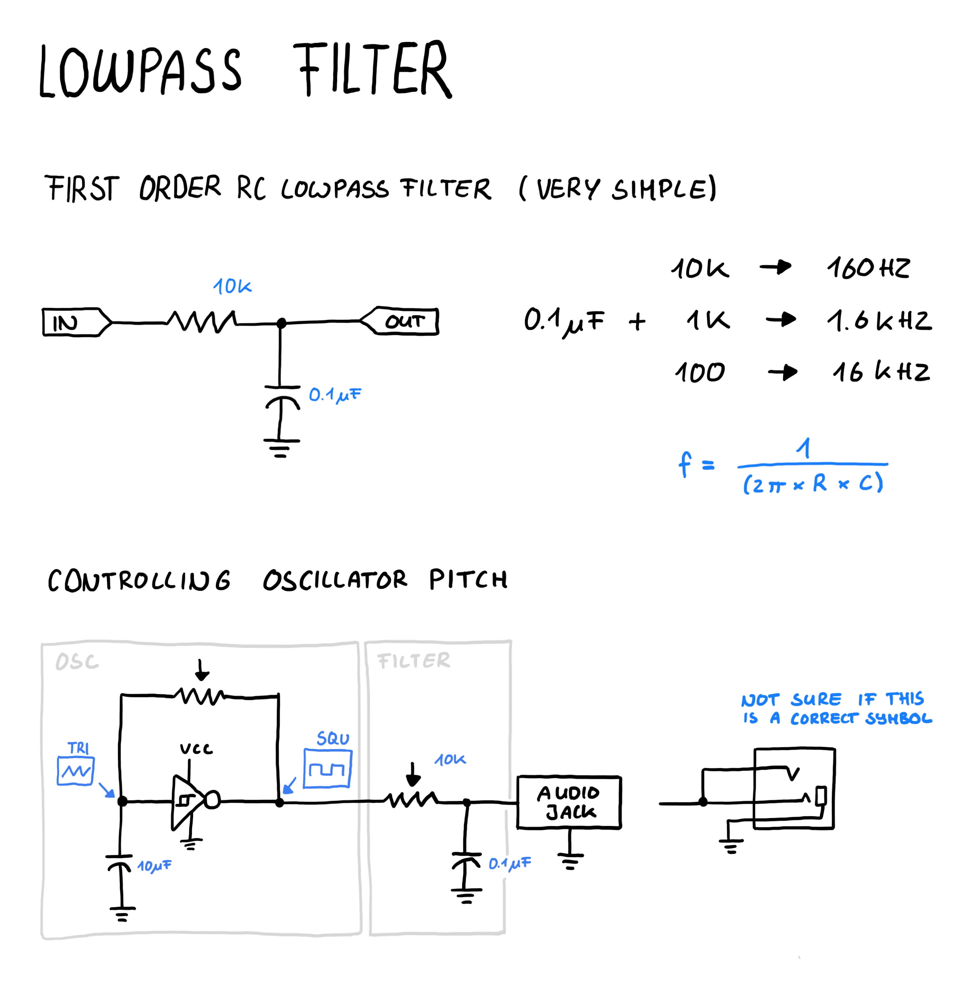

# Building a simple lowpass filter

The next step in the [tutorial](https://www.glitchn.net/course/lesson-5-add-a-filter) video was to replace the ldr with a potentiometer and then add a filter.

This filter uses a resistor and capacitor to act as a first order rc lowpass filter.

There are different ressources that explain this as well:

- [Moritz Klein](https://www.youtube.com/watch?v=3tMGNI--ofU)
- [Craig Stuntz](https://www.craigstuntz.com/posts/2025-09-09-building-a-synthesizer-12.html)
- [Fluxmonkey](https://www.fluxmonkey.com/electronoize/passiveDividersFilters.htm)

One thing I also noticed that the transistor circuit part for the speaker does make things unnecessary complicated, so its better to use real speakers with an amp here instead.

## Drawing

## Learnings

- Stick to the schematics from the tutorials especially when doing things for the first time (avoid solving things differently since it sometimes makes things unnecessary complex)
- There are many different types of filters
