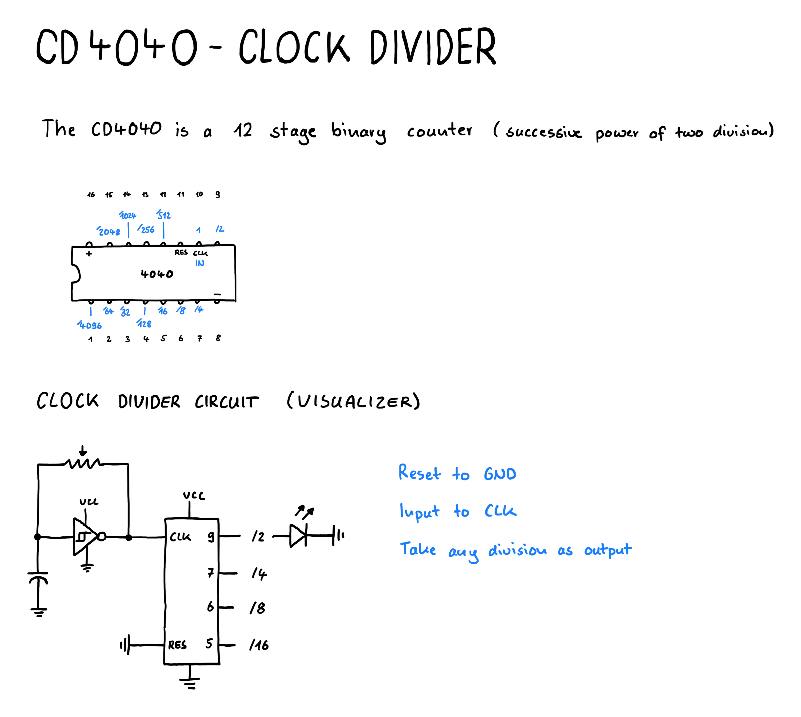

# Using a CD4040 as a clock divider

The `CD4040` is a 12 stage binary counter that performs a successive power of two division.

You can feed it an input (like the square wave from the `CD40106` oscillator) at the CLK pin and generate divisions of that signal.

The [glitch'n Day 1 - Lesson 6](https://www.glitchn.net/course/lesson-6-light-patterns) uses LEDs to visualize that pattern.

The behavior is well explained in this article: [Little Scale - 4040 Divided Oscillator](http://little-scale.blogspot.com/2017/03/fun-with-sea-moss-4040-divided.html)

## Lunetta Synths

Building an oscillator and clock divider with those types of ICs is part of a thing called Lunetta Synths.
There are different ressources available explaining this in detail:
- [Jon Dent - CMOS usefull chips for lunetta synths](https://djjondent.blogspot.com/2017/08/cmos-useful-chips-for-lunetta-synths.html)
- [Intro to Lunetta CMOS Synths](https://docs.google.com/document/d/1V9qerry_PsXTZqt_UDx7C-wcuMe_6_gyy6M_MyAgQoA/edit?tab=t.0)
- [Electro Music - Lunetta Related Topics](https://electro-music.com/forum/topic-42772.html)
- [Hackaday - Logic Noise Series](https://hackaday.com/tag/logic-noise/)

## Drawing

## Learnings

- The CD4040 based clock divider is quite simple
- The ressources on logic chip based synthesizers are very distributed
