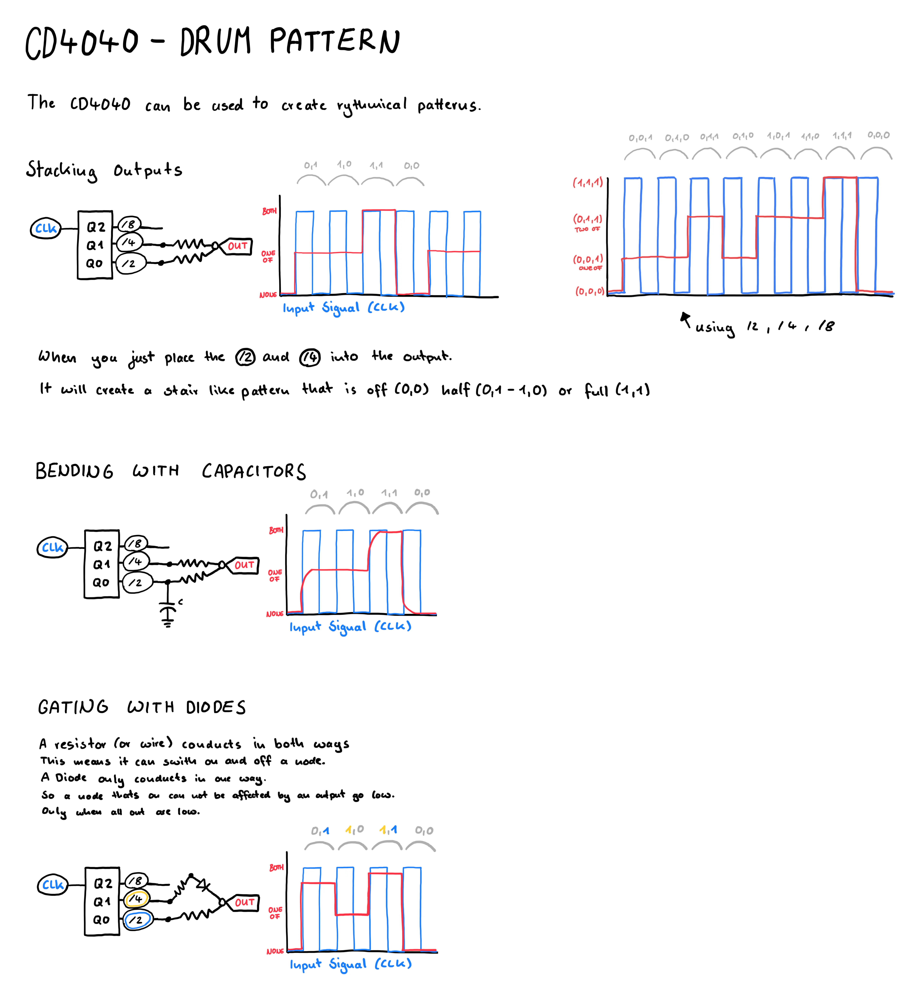

# Building a simple drum machine with the cd4040

The outputs of the `cd4040` can create rythmic patterns when combined into one node at the speaker.

There are several components available to make the connection, which when combined create a very complex result.

- Resistor: using only those will result in a stepped output based on how many high or low signals there are
- Diode: only conducts in one direction, resulting in different patterns than resistors
- Capacitor: does not affect the pattern directly, but will smooth the otherwise hard edges of the binary outputs

While trying to [simulate](https://www.falstad.com/s.php?s=v0EciC) the circuit, I noticed that I do not really understand the behavior of diodes, especially when mixed. 
This is something that needs further investigation.

The [glitch'n Day 1 - Lesson 7](https://www.glitchn.net/course/lesson-7-drum-machine) shows how this approach can be used to create rythmical clicks that form a drum pattern.

## Drawing

## Learnings

- Circuit simulators assume perfect conditions which real circuits never have
- Looking at signals can help understanding a circuit in detail
