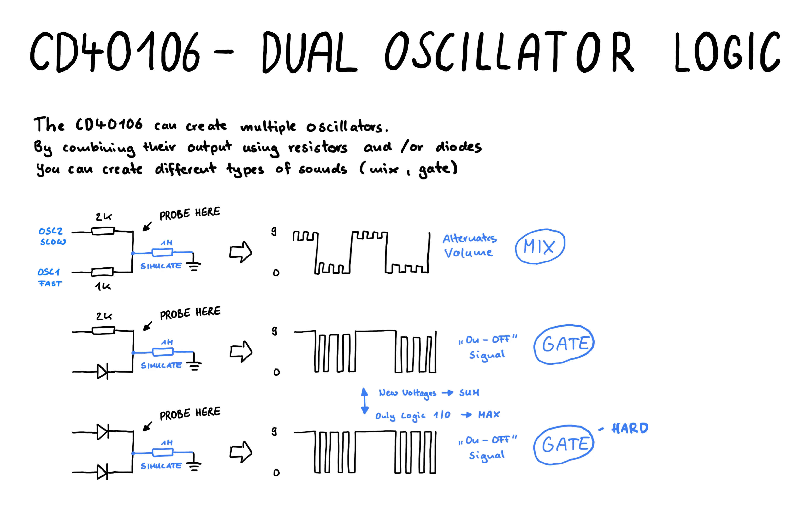

# Dual Oscillator Logic using the CD40106

In [Glitch Week 2 Day 2](https://www.glitchn.net/course/lesson-2-add-a-second-slow-oscillator) you learn how create two oscillators 
from one CD40106 and combine them in different ways using resistors and / or diodes.

From my observations I assume the following:
- Resistors do arithmetic. They mix / average multiple signals. (Two resistors create a siren like sound) [View Resistor Simulation](https://www.falstad.com/s.php?s=eRXGf6)
- Diodes do some sort of logic. They gate multiple signals. (Two diodes create a beep like sound) [View Diode Simulation](https://www.falstad.com/s.php?s=BUxPWw)
- You can combine them to get something in between. [View Mixed Simulation](https://www.falstad.com/s.php?s=DUd4Fx)

## Drawing

## Learnings

- As long as all circuits are floating you can measure (at commen ground) with an oscilloscope and use speakers at the same time.
- Resistors do arithmetic and diodes do some sort of logic, when mixing signals
