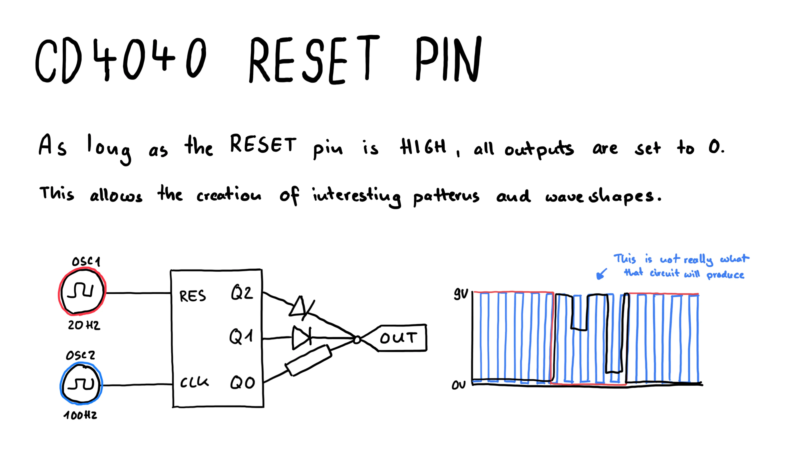

# Reset pin on the CD4040

The `CD4040` binary counter increases by one bit on every high value on the `CLK` pin.

This creates an every increasing binary number, which as we learned befor can also be used as a frequency divider.

The increments can also be set to 0 again when the `RESET` pin is high and it stays at 0 as long it is high.

[View Simulation](https://www.falstad.com/s.php?s=U4a1Iv)

Depending on the freqency, this can generate interesting rythmical patterns as shown in [Glitch'n Day 2 - Lesson 6](https://www.glitchn.net/course/lesson-6-wonky-beats-with-4040-reset) or audio rate waveforms.

## Drawing

## Learnings
- As long as the reset pin on the cd4040 is high the counter will stay at zero
- Using the reset pin can create interesting patterns
